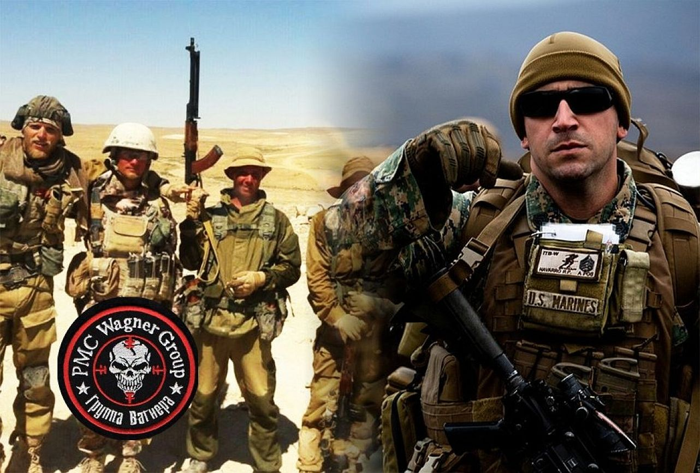

"Как я ехал домой из командировки'
"Часть первая"
Путь от опорника до базы нашего отряда
 Вначале мы думали что полетим на самотете, но потом его отменили и отправили нас на вертолете, который мы ждали более 2х часов, так как он сперва полетел на задачу, а потом только к нам. Нас отправили на впп заранее, поэтому там мы проторчали дольше 4х часов частично под пождем.
 Пока мы находились на ВПП мы успели проголодаться, так как пропустили обед к тому же начался довольно сильный ливень и нам пришлось прятаться от него в палатке.
 
"Часть вторая"
"Как мы добирались от базы отряда до столицы"
 От базы отряда нас отправили с тыловой колонной. Выехали ночью, так как ехать было больше 300 км. В кухове Урала тястись такое себе удовольствие. Повезло что сидел на матрасе.
"Часть третья"
Как я летел из столицы нашей столицы
В столицу мы добрались около 14-00 по местному времени и нас сраду отвезли в аэропорт. Мы с парнями конечно хотели успеть попасть на рынок и там закупиться всяким шматьем. Так как этого находились в джунгях где кроме диких животных никого небыло. Тратить деньги некуда и поэтому местных денег накопилось приличное количество.
"Из столицы в солицу - продолжение"
В общем мне и ещё 4 парным удалось сгонять на рынок. Там я купил пару кроссовок и футболку. Но самое интересное окозалось потом. После прохождения досмотра и погрузки в самолет оказалось, чт один из его двигателей неизправен. Нас выгнали из самолета, а время было 4 часа ночи. И нам пришлось спать прям на ВПП аэродрома, пока техники ремонтировали неисправность. За это время мы успели поспать, поесть и снова поспать. В 10 утра самолет взлетел ...
